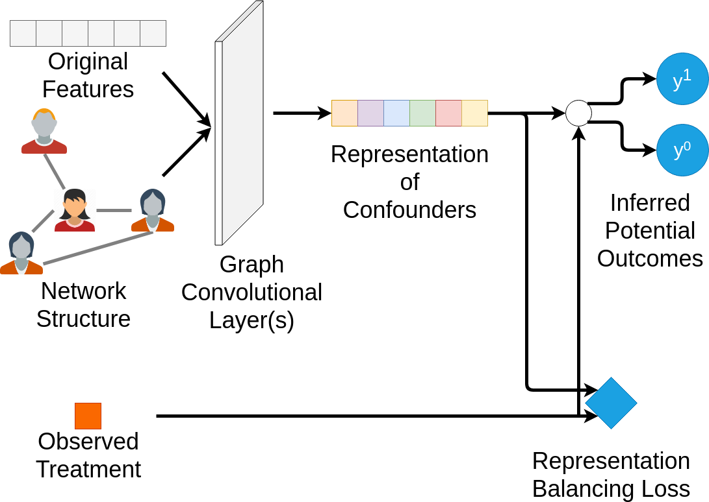

# Social Computing - Learning Causal Effects from Networked Data

### Project group members

```
Kevin Chen
Bongwoo Jeon
Anugrah Vaishnav
```

Original paper - [Learning Individual Causal Effects from Networked Observational Data](https://arxiv.org/abs/1906.03485).

### Overview of the Network Deconfounder



### Dependencies

```
Python 3.11.8
Pytorch 2.2.1
Torch Geometric 2.5.3
Scipy 1.12.0
Numpy 1.26.4
Pandas 2.2.1
```

### Datasets

Datasets used in this paper can be found in ```./datasets/BlogCatalog```

### Running the experiment

Run the bash script for all different hyperparameters

```
bash run_for_share.sh
```

Run the python script for a single combination of parameters

```
python main.py --tr 0.6 --path ./datasets/ --dropout 0.1 --weight_decay 1e-5 --alpha 1e-4 --lr 1e-3 --epochs 200 --dataset BlogCatalog1 --norm 1 --nin 1 --nout 3 --hidden 200 --clip 100.
```

Then results would be added to the end of the corresponding csv files in ./new_results/Blogcatalog1

### Original paper citation

```
@inproceedings{guo2020learning,
  title={Learning Individual Causal Effects from Networked Observational Data},
  author={Guo, Ruocheng and Li, Jundong and Liu, Huan},
  booktitle={Proceedings of the 13th International Conference on Web Search and Data Mining},
  pages={232--240},
  year={2020}
}
```
